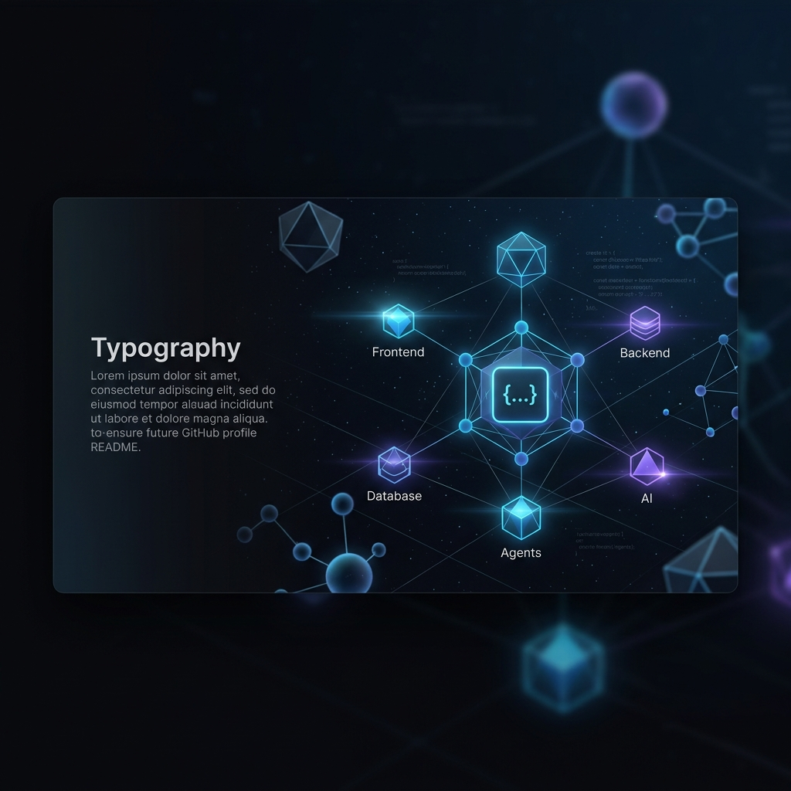
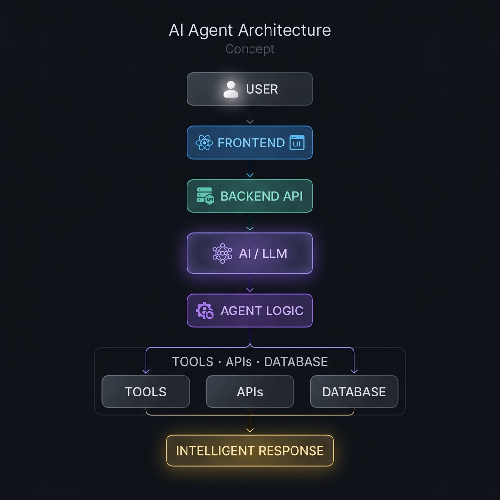

<div align="center">

<!-- ═══════════════════════════════════════════════════════════════════ -->
<!--                      HERO IDENTITY                                 -->
<!-- ═══════════════════════════════════════════════════════════════════ -->


<!-- Typing animation — name and titles -->
<a href="https://github.com/thronmuthu18">
  
</a>

<br/>

<a href="https://github.com/thronmuthu18">
  
</a>

<br/>

<p align="center">
  
  &nbsp;
  
  &nbsp;
  
  &nbsp;
  
</p>

<br/>

> **Building Full Stack applications, AI-powered systems, and intelligent software experiences.**

<br/>

<p align="center">
  <a href="https://sudalaimuthuportfolio.netlify.app/">
    
  </a>
  &nbsp;
  <a href="https://www.linkedin.com/in/sudalai-muthu-465516309/">
    
  </a>
  &nbsp;
  <a href="mailto:sudalaimuthusudalai754@gmail.com">
    
  </a>
  &nbsp;
  <a href="https://champai-theta.vercel.app/chat">
    
  </a>
</p>

</div>

<br/>

---

## About Me

I am a **Computer Science & Engineering** student and **Full Stack Developer** based in Tirunelveli, Tamil Nadu, India. I build modern, production-oriented web applications that work across the full stack — crafting **frontend interfaces**, engineering **backend APIs**, integrating **databases**, and deploying to **cloud platforms**.

My projects span real-world business websites, full stack web applications, and AI-powered applications — including a live multimodal AI assistant that handles **chat, voice, file, and image** workflows. I also build for real clients, translating practical business requirements into functional, deployed software.

I work primarily with **React, TypeScript, Node.js, Express.js, MongoDB, and Python**, and I integrate AI capabilities through **LLM APIs and AI agent patterns** to build intelligent application experiences. My current direction is bridging solid Full Stack engineering with **AI-powered application development** and **AI agent system design** — building software where intelligent systems enhance real-world workflows.

I approach problems from a production mindset: real deployments, real users, real outcomes.

```text
Frontend    →  React · TypeScript · JavaScript · Tailwind CSS · HTML · CSS
Backend     →  Node.js · Express.js · Python
Database    →  MongoDB · MySQL
Deployment  →  Vercel · Netlify
AI Focus    →  AI-powered applications · AI agent development · LLM integrations
```

<br/>

---

<!-- ═══════════════════════════════════════════════════════════════════ -->
<!--                   MAIN VISUAL — TECH STACK PIPELINE                -->
<!-- ═══════════════════════════════════════════════════════════════════ -->

<div align="center">



</div>

<br/>

---

## Current Focus

<div align="center">

|   | Focus Area | Status |
|:---:|:---|:---|
| ⚡ | **Full Stack Web Development** | Active |
| 🔩 | **Backend Engineering** | Active |
| 🤖 | **AI-Powered Applications** | Expanding |
| 🧠 | **AI Agent Development** | Exploring |
| 🚀 | **Production-Ready Web Applications** | Ongoing |

</div>

<br/>

---

## Technical Stack

<div align="center">

**Frontend**

<p>
  
  &nbsp;
  
  &nbsp;
  
  &nbsp;
  
  &nbsp;
  
  &nbsp;
  
</p>

**Backend**

<p>
  
  &nbsp;
  
  &nbsp;
  
</p>

**Database**

<p>
  
  &nbsp;
  
</p>

**Tools & Deployment**

<p>
  
  &nbsp;
  
  &nbsp;
  
  &nbsp;
  
</p>

</div>

<br/>

---

## Featured Projects

<br/>

### 🤖 Champ AI — Intelligent AI Assistant

> An AI-powered assistant application supporting chat, voice, files, images, and multimodal workflows.

Built as a production-deployed web application, Champ AI integrates AI capabilities into a real-time interface — handling multiple input modalities including text chat, voice interaction, file processing, and image workflows.

| Detail | Info |
|:---|:---|
| **Type** | AI-Powered Web Application |
| **Interface** | React · TypeScript · Vite |
| **Deployment** | Vercel |
| **AI Capabilities** | Chat · Voice · Files · Images · Multimodal |
| **Live App** | [champai-theta.vercel.app/chat](https://champai-theta.vercel.app/chat) |
| **Repository** | [AI-Voice-Companion](https://github.com/thronmuthu18/AI-Voice-Companion) |

<div align="center">

[](https://champai-theta.vercel.app/chat)
&nbsp;
[](https://github.com/thronmuthu18/AI-Voice-Companion)

</div>

<br/>

---

### 📄 CV Builder — Resume Generation Tool

> A web-based application for creating and exporting professional resumes.

CV Builder is a frontend-driven web application that enables users to build structured, professional resumes through an interactive interface with real-time preview and export capability.

| Detail | Info |
|:---|:---|
| **Type** | Full Stack Web Application |
| **Stack** | React · JavaScript · CSS |
| **Status** | Developed |

<br/>

---

### 🏗️ CB Builders — Real-World Business Website

> A professional business website developed for a real-world construction business, focused on presenting services, company information, and a modern digital presence.

CB Builders is a client-facing construction business website developed to provide a professional online presence and clearly present the company's services and business information through a modern, responsive web experience. This project demonstrates practical frontend development for a real-world client — translating business requirements into a functional, production-deployed web presence complete with an image gallery, service sections, animated scroll interactions, and a contact interface.

| Detail | Info |
|:---|:---|
| **Type** | Business Website |
| **Client Type** | Construction Business |
| **Technology** | HTML · CSS · JavaScript · AOS · Swiper · Font Awesome |
| **Deployment** | Netlify |
| **Live App** | [cb-builders.netlify.app](https://cb-builders.netlify.app/) |
| **Repository** | [CB-builders](https://github.com/thronmuthu18/CB-builders) |

<div align="center">

[](https://cb-builders.netlify.app/)
&nbsp;
[](https://github.com/thronmuthu18/CB-builders)

</div>

<br/>

---

### 🦾 AI Humanized Robot Assistant

> An AI-oriented project exploring humanized robot assistant behavior and natural interaction.

This project explores the intersection of AI and human-computer interaction — developing an assistant that applies AI-driven logic to simulate natural, humanized responses and contextual behaviors.

| Detail | Info |
|:---|:---|
| **Type** | AI / Intelligent Systems Project |
| **Focus** | Humanized AI interaction · Assistant behavior |
| **Status** | In Development |

<br/>

---

## Building Intelligent Systems

I am a Full Stack Developer actively expanding into **AI engineering** and **AI agent development**.

My current direction bridges Full Stack software engineering with AI-powered system design:

```
Full Stack Foundation
        │
        ├── Frontend interfaces that consume AI outputs
        ├── Backend APIs that orchestrate AI services
        ├── Database layers that persist intelligent context
        │
        └── AI Integration Layer
                │
                ├── LLM API integrations
                ├── Multimodal AI (text · voice · image · file)
                ├── AI agent logic and tool use
                └── Intelligent application workflows
```

> This is not a claim of advanced AI research expertise.
> This is a Full Stack Developer building real applications that integrate AI — and developing toward AI agent engineering.

<br/>

---

## AI Agent Architecture — Concept

<div align="center">



</div>

<br/>

The architecture I work toward when building AI-integrated applications:

<div align="center">

```
         ┌─────────────┐
         │    USER     │
         └──────┬──────┘
                │
         ┌──────▼──────┐
         │  FRONTEND   │  React · TypeScript
         └──────┬──────┘
                │
         ┌──────▼──────┐
         │ BACKEND API │  Node.js · Express.js
         └──────┬──────┘
                │
         ┌──────▼──────┐
         │   AI / LLM  │  Language Model · AI Service
         └──────┬──────┘
                │
         ┌──────▼──────┐
         │ AGENT LOGIC │  Tool selection · Reasoning
         └──────┬──────┘
                │
    ┌───────────┼───────────┐
    │           │           │
┌───▼───┐  ┌───▼───┐  ┌────▼────┐
│ TOOLS │  │ APIs  │  │DATABASE │
└───────┘  └───────┘  └─────────┘
                │
         ┌──────▼──────────────┐
         │  INTELLIGENT RESPONSE│
         └─────────────────────┘
```

*AI Agent Architecture — Concept*

</div>

> **Note:** This represents my architectural direction and the design pattern implemented in Champ AI. Not all current projects implement the full agent stack.

<br/>

---

## GitHub Activity

<div align="center">


&nbsp;


<br/><br/>


</div>
<br/>

---

## Contribution Activity

<div align="center">


</div>

<br/>

---

## Experience

<br/>

**Full Stack Web Development Intern**
`CodeSpark Software Developments`

> Gained hands-on experience in full stack web application development through a professional internship engagement.

<br/>

**Internship / Learning Experience**
`Procode Technologies`

> Practical exposure to software development processes and technology workflows.

<br/>

---

## Current Development Direction

```text
 Phase 1  ✅  Full Stack Web Development — HTML · CSS · JS · React · Node.js · MongoDB
 Phase 2  ✅  Backend Engineering — Express.js · REST APIs · Database design
 Phase 3  🔄  AI-Powered Applications — LLM integrations · AI features in web apps
 Phase 4  🔄  AI Agent Development — Agent logic · Tool use · Multimodal AI workflows
 Phase 5  ⏳  Production AI Systems — Scalable, deployed, intelligent applications
```

<br/>

---

## Connect With Me

<div align="center">

<a href="https://github.com/thronmuthu18">
  
</a>
&nbsp;
<a href="https://www.linkedin.com/in/sudalai-muthu-465516309/">
  
</a>
&nbsp;
<a href="https://sudalaimuthuportfolio.netlify.app/">
  
</a>
&nbsp;
<a href="mailto:sudalaimuthusudalai754@gmail.com">
  
</a>

<br/><br/>


<br/>

<sub>
  Built with precision · No fabricated metrics · No fake achievements · Only real work
</sub>

<br/>

<sub>
  © A. Sudalai Muthu · Tirunelveli, Tamil Nadu, India
</sub>

</div>
